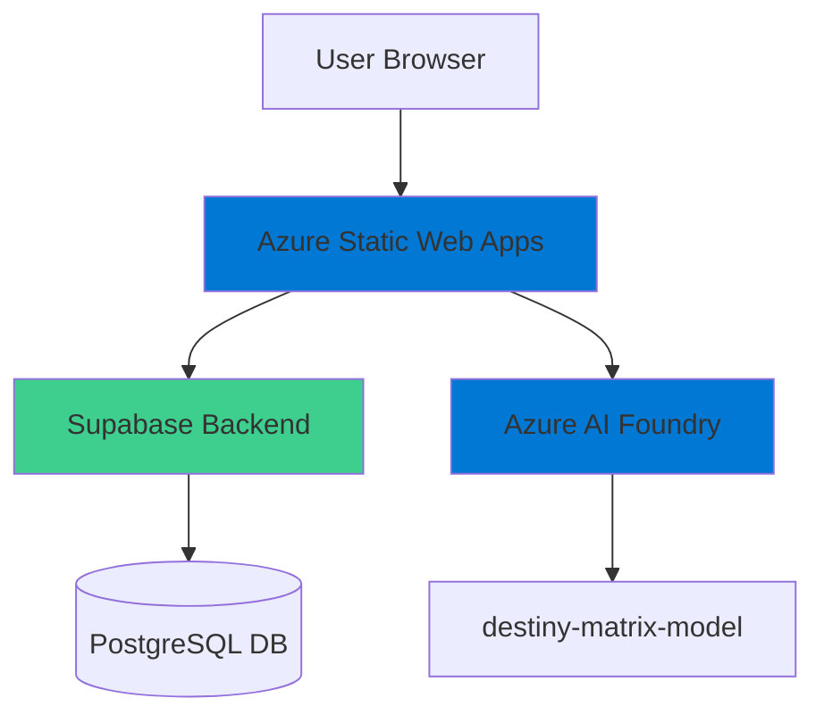

# Azure Deployment Plan for destiny-chart-insight Project

## **Goal**
Deploy the Destiny Chart Insight React application to Azure Static Web Apps with integration to existing Azure AI Foundry and Supabase backend.

## **Project Information**

**AppName**: destiny-chart-insight

- **Technology Stack**: React 18.3.1 + TypeScript + Vite 5.4.19
- **Application Type**: Static web application (SPA) for numerology destiny matrix calculations
- **Build Output**: Static files (HTML, CSS, JS) generated by Vite
- **External Dependencies**: 
  - Supabase (PostgreSQL, Auth, RLS) - Already configured
  - Azure AI Foundry (AI-powered insights) - Already configured
- **Hosting Recommendation**: Azure Static Web Apps (optimal for React SPAs with API integration)

## **Azure Resources Architecture**

> **Install the mermaid extension in IDE to view the architecture.**



**Data Flow:**
- Users access the React SPA through Azure Static Web Apps CDN
- The frontend communicates with Supabase for user authentication and data persistence
- AI insights are generated via Azure AI Foundry using the destiny-matrix-model deployment
- Static assets are served from Azure's global CDN for optimal performance

## **Recommended Azure Resources**

### Application: destiny-chart-insight

- **Hosting Service Type**: Azure Static Web Apps
- **SKU**: Free tier (includes 100 GB bandwidth/month, custom domains, SSL)
- **Configuration**:
  - **Build Tool**: Vite
  - **Build Command**: `npm run build`
  - **Output Directory**: `dist`
  - **App Location**: `/`
  - **Environment Variables**:
    - `VITE_SUPABASE_PROJECT_ID`: Supabase project ID
    - `VITE_SUPABASE_PUBLISHABLE_KEY`: Supabase anon key
    - `VITE_SUPABASE_URL`: Supabase API URL
    - `VITE_AZURE_AI_ENDPOINT`: Azure OpenAI endpoint
    - `VITE_AZURE_AI_KEY`: Azure OpenAI API key (should be stored in Key Vault)
    - `VITE_AZURE_AI_MODEL`: Model deployment name

### External Dependencies (Already Configured)

- **Supabase**
  - Service Type: External SaaS (PostgreSQL + Auth + Storage)
  - Connection Type: HTTPS REST API
  - Already provisioned and configured

- **Azure AI Foundry**
  - Service Type: Azure OpenAI Service
  - Resource Name: soulplus-af
  - Model Deployment: destiny-matrix-model
  - Connection Type: API Key authentication
  - Already provisioned and configured

### Recommended Supporting Services

- **Application Insights**
  - Monitoring and telemetry for the Static Web App
  - Automatic integration with Static Web Apps

- **Key Vault**
  - Store sensitive configuration (Azure AI API key)
  - Prevents exposure of secrets in environment variables

- **Azure CDN**
  - Included with Static Web Apps
  - Global content delivery for optimal performance

### Recommended Security Configurations

- **Managed Identity**: Use Azure Managed Identity for Key Vault access
- **Key Vault Integration**: Store `VITE_AZURE_AI_KEY` in Key Vault
- **CORS Configuration**: Configure CORS for Supabase domain
- **Custom Domain**: Configure custom domain with SSL/TLS
- **Environment Separation**: Use Static Web Apps environments (production/staging)

## **Execution Steps**

> **Below are the steps for Copilot to follow; ask Copilot to update or execute this plan.**

### 1. Prepare the Application

1. **Create Dockerfile for optional container deployment**:
   ```dockerfile
   FROM node:18-alpine as build
   WORKDIR /app
   COPY package*.json ./
   RUN npm ci
   COPY . .
   RUN npm run build
   
   FROM nginx:alpine
   COPY --from=build /app/dist /usr/share/nginx/html
   COPY nginx.conf /etc/nginx/conf.d/default.conf
   EXPOSE 80
   CMD ["nginx", "-g", "daemon off;"]
   ```

2. **Create staticwebapp.config.json** for routing:
   ```json
   {
     "navigationFallback": {
       "rewrite": "/index.html",
       "exclude": ["/assets/*", "/*.{css,js,png,jpg,gif,svg,ico}"]
     },
     "routes": [
       {
         "route": "/api/*",
         "allowedRoles": ["anonymous", "authenticated"]
       }
     ],
     "responseOverrides": {
       "404": {
         "rewrite": "/index.html"
       }
     }
   }
   ```

### 2. Provision Azure Infrastructure

#### Option A: Azure Static Web Apps (Recommended for React SPA)

1. **Create Azure Static Web App**:
   ```bash
   az staticwebapp create \
     --name destiny-chart-insight \
     --resource-group rg-destiny-chart \
     --location "East US 2" \
     --source https://github.com/weblitvinenko/destiny-chart-insight \
     --branch main \
     --app-location "/" \
     --output-location "dist" \
     --login-with-github
   ```

2. **Configure Environment Variables**:
   ```bash
   az staticwebapp appsettings set \
     --name destiny-chart-insight \
     --resource-group rg-destiny-chart \
     --setting-names \
       VITE_SUPABASE_PROJECT_ID=zinfmmyxkcafmurkznyh \
       VITE_SUPABASE_URL=https://zinfmmyxkcafmurkznyh.supabase.co \
       VITE_AZURE_AI_ENDPOINT=https://soulplus-af.openai.azure.com \
       VITE_AZURE_AI_MODEL=destiny-matrix-model
   ```

3. **Store sensitive keys in Key Vault**:
   ```bash
   # Create Key Vault
   az keyvault create \
     --name kv-destiny-chart \
     --resource-group rg-destiny-chart \
     --location "East US 2"
   
   # Store secrets
   az keyvault secret set \
     --vault-name kv-destiny-chart \
     --name supabase-key \
     --value "eyJhbGciOiJIUzI1NiIsInR5cCI6IkpXVCJ9..."
   
   az keyvault secret set \
     --vault-name kv-destiny-chart \
     --name azure-ai-key \
     --value "8HeybOq1OgVFfrIHC7VXlzFrRzSsN1Te6KrciYuGLh12..."
   ```

#### Option B: Azure Container Apps (Alternative)

If you prefer container-based deployment:

1. Get IaC rules from the tool `iac-rules-get`
2. Generate Bicep files for:
   - Azure Container Registry
   - Azure Container Apps
   - Log Analytics Workspace
   - Application Insights
3. Run `azd init` and `azd up`

### 3. Deploy the Application

**For Static Web Apps (GitHub Actions)**:
- GitHub Actions workflow is automatically created
- Push to main branch triggers deployment
- Build and deploy happen automatically

**Manual deployment**:
```bash
# Build the application
npm run build

# Deploy using SWA CLI
npm install -g @azure/static-web-apps-cli
swa deploy ./dist \
  --app-name destiny-chart-insight \
  --resource-group rg-destiny-chart \
  --deployment-token <YOUR_DEPLOYMENT_TOKEN>
```

### 4. Verify Deployment

1. Check deployment status:
   ```bash
   az staticwebapp show \
     --name destiny-chart-insight \
     --resource-group rg-destiny-chart
   ```

2. Test the application:
   - Navigate to the Static Web App URL
   - Test destiny matrix calculation
   - Test AI insights generation
   - Verify Supabase authentication

3. Monitor with Application Insights:
   ```bash
   az monitor app-insights component show \
     --app destiny-chart-insight \
     --resource-group rg-destiny-chart
   ```

### 5. Summary

Create `.azure/summary.copilot.md` with:
- List of all deployed resources
- Configuration changes made
- URLs and endpoints
- Next steps for custom domain setup

## **Cost Estimation**

- **Azure Static Web Apps**: Free tier (suitable for development/staging)
- **Azure Static Web Apps Standard**: ~$9/month (for production with custom features)
- **Key Vault**: ~$0.03/10,000 operations
- **Application Insights**: Free tier (5GB/month)
- **Total Estimated Monthly Cost**: $9-15/month (excluding existing AI Foundry costs)

## **Next Steps After Deployment**

1. Configure custom domain (if needed)
2. Set up staging environments
3. Configure GitHub branch policies
4. Enable monitoring and alerts
5. Implement CI/CD improvements
6. Consider CDN optimization
