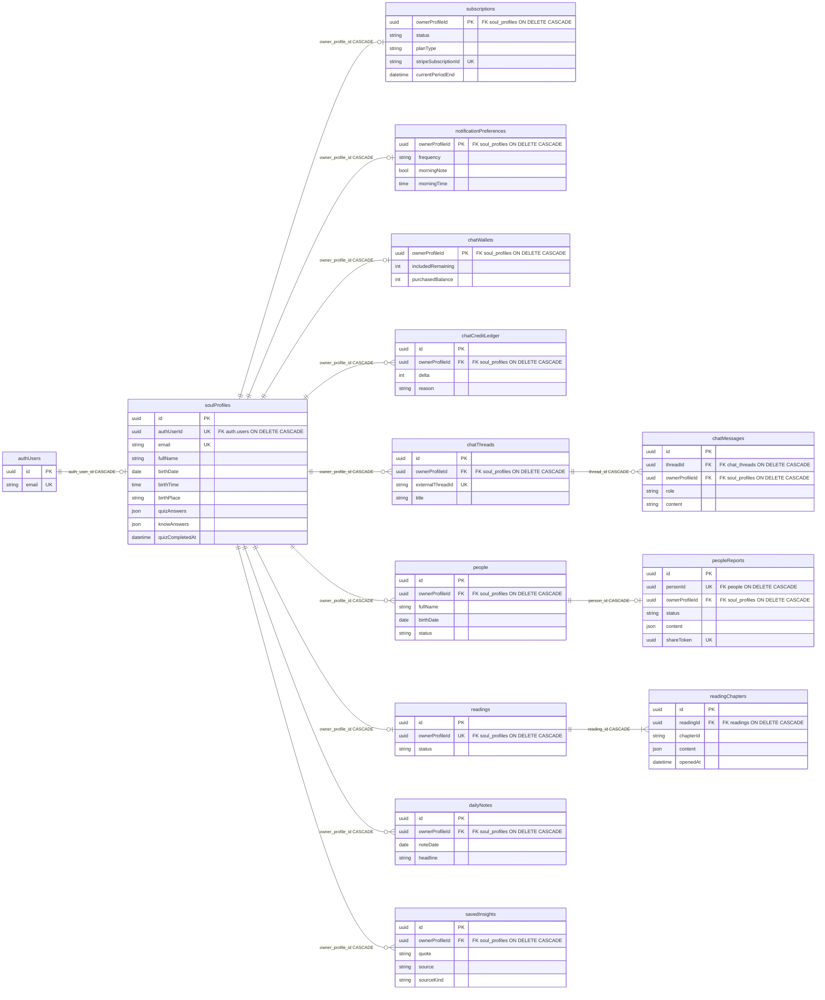

# SoulPlus AI V2 — planned ERD

**This is not a migration.** Do not run it. It is the target schema so we add one table (one feature) at a time.

Visual board (FigJam): [SoulPlus V2 planned ERD](https://www.figma.com/board/6LeVkl0m7qxS4KSj9djZGU)

**Now in the database:** `soul_profiles`, `quiz_intents`, `subscriptions`, `stripe_events`.

## Delete / FK policy (locked)

Auth is the root. `soul_profiles` is the hub. User-owned rows hang off the hub.

```text
auth.users
  └── soul_profiles.auth_user_id     ON DELETE CASCADE

soul_profiles
  └── <table>.owner_profile_id       ON DELETE CASCADE
```

| Do | Do not |
|---|---|
| Child tables FK `owner_profile_id → soul_profiles(id) ON DELETE CASCADE` | `ON DELETE SET NULL` on those FKs |
| Nested children CASCADE from their parent (`people_reports → people`, `reading_chapters → readings`, `chat_messages → chat_threads`) | Point user tables at `auth.users` |
| `quiz_intents`: no Auth FK; email trigger purge | Put PII on `stripe_events` or CASCADE it from Auth |
| `stripe_events`: no user FK (idempotency only) | Treat Stripe as a Postgres FK |

The auth user is created **after Stripe payment**, not at the quiz email gate.

## Add next, in this order

Every new table below must use the CASCADE rule above. Seed 1:1 side tables (`notification_preferences`, `chat_wallets`) in that same feature migration — not before those tables exist.

| Next | Feature to wire first | Tables |
|---|---|---|
| notifications | Account · Notifications | `notification_preferences` |
| people | People add / list / report | `people`, `people_reports` |
| readings | Readings + home daily note | `readings`, `reading_chapters`, `daily_notes` |
| insights | Saved insights | `saved_insights` |
| chat | Chat history + top-up credits | `chat_threads`, `chat_messages`, `chat_wallets`, `chat_credit_ledger` |

## Target diagram



`quiz_intents` — email-keyed pre-auth stash; purged by trigger, not an FK. Off the diagram.

`stripe_events` — webhook idempotency; no user FK. Off the diagram.

## Not in V2

V1 `quiz_leads`, `profiles`, `admins`, `saved_matrices`, `diary_entries`, analytics. Stay in `src/legacy/supabase/`.
