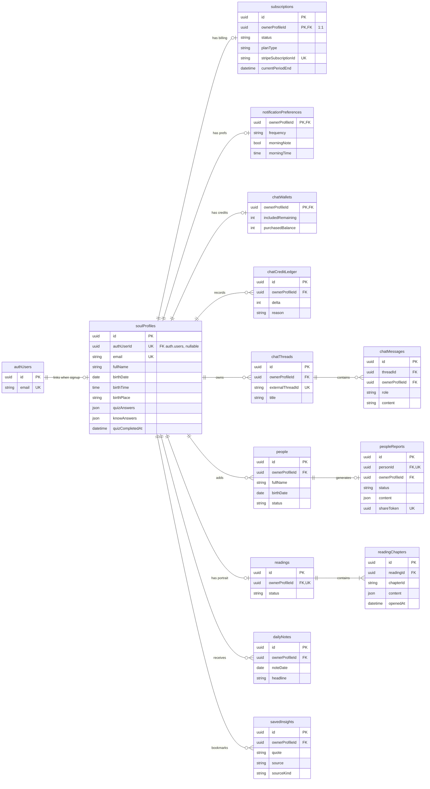

# SoulPlus AI V2 — planned ERD

**This is not a migration.** Do not run it. It is the target schema so we add one table (one feature) at a time.

Visual board (FigJam): [SoulPlus V2 planned ERD](https://www.figma.com/board/6LeVkl0m7qxS4KSj9djZGU)

**Now in the database:** `soul_profiles` (migrations `001` + `002`).

**Rule:** child tables use `owner_profile_id → soul_profiles.id`. Auth is only the login door.

## Add next, in this order

| Next migration | Feature to wire first | Tables |
|---|---|---|
| `003` | Paywall / home paid-trial-unpaid | `subscriptions`, `stripe_events` |
| `004` | Account · Notifications | `notification_preferences` |
| `005` | People add / list / report | `people`, `people_reports` |
| `006` | Readings + home daily note | `readings`, `reading_chapters`, `daily_notes` |
| `007` | Saved insights | `saved_insights` |
| `008` | Chat history + top-up credits | `chat_threads`, `chat_messages`, `chat_wallets`, `chat_credit_ledger` |

When a row is added, seed 1:1 side tables (`notification_preferences`, `chat_wallets`) in that same feature migration — not before those tables exist.

## Target diagram

`stripe_events` is webhook idempotency only (no FK to profiles). Leave it off the diagram.

## Not in V2

V1 `quiz_leads`, `profiles`, `admins`, `saved_matrices`, `diary_entries`, analytics. Stay in `src/legacy/supabase/`.
